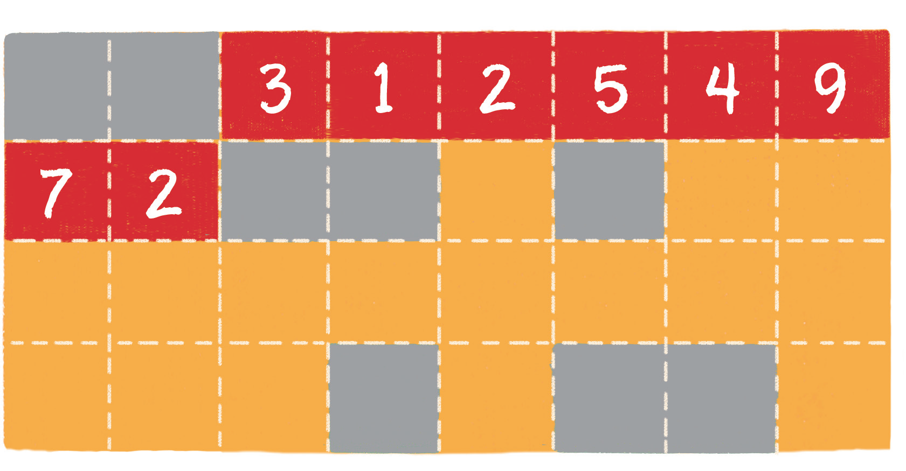

什么是数组？

数组对应的英文是 array，是有限个相同类型的变量所组成的有序集合，数组中的每一个变量被称为元素。数组是最为简单、最为常用的数据结构。

正如军队里的士兵存在编号一样，数组中的每一个元素也有着自己的下标，只不过这个下标从 0 开始，一直到数组长度 - 1。

数组的另一个特点，是在内存中 **顺序存储**，因此可以很好地实现逻辑上的 **顺序表**。

数组在内存中的顺序存储，具体是什么样子呢？

内存是由一个个连续的内存单元组成的，每一个内存单元都有自己的地址。在这些内存单元中，有些被其他数据占用了，有些是空闲的。

数组中的每一个元素，都存储在小小的内存单元中，并且元素之间紧密排列，既不能打乱元素的存储顺序，也不能跳过某个存储单元进行存储。

在上图中，橙色的格子代表空闲的存储单元，灰色的格子代表已占用的存储单元，而红色的连续格子代表数组在内存中的位置。

不同类型的数组，每个元素所占的字节个数也不同，本图只是一个简单的示意图。

数组元素的插入、删除时间复杂度都是O(n)。

数组有非常高效的随机访问能力，只要给出下标，就能在常亮时间找到对应的元素。

数组的劣势体现在插入和删除元素方面，由于数组元素连续紧密的存储在内存中，插入、删除元素都会导致大量元素被迫移动，影响效率。

所以，数组适合读操作多、写操作少的场景。