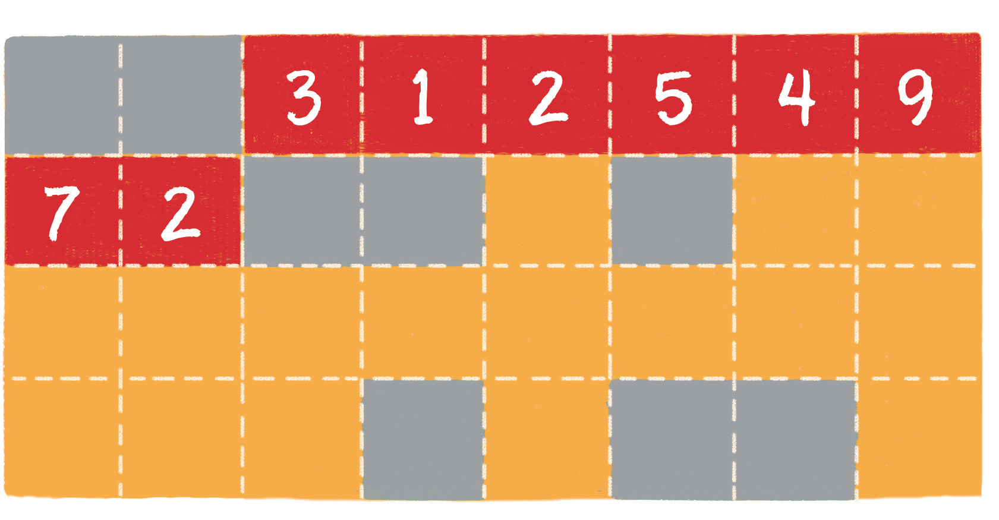
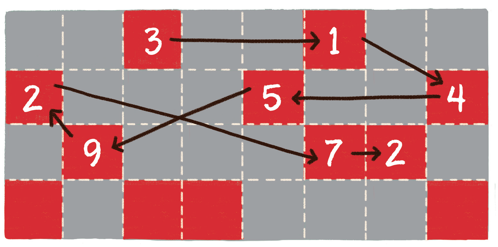

链表是什么？

如果说数组是纪律严明的正规军，那么链表就是灵活多变的地下党

地下党都是一些什么样的人物呢?

在影视作品中，我们可能都见到过地下工作者的经典话语：

“上级的姓名、住址，我知道，下级的姓名、住址，我也知道，但是这些都是我们党的秘密，不能告诉你们！”

地下党借助这种单线联络的方式，灵活隐秘地传递着各种重要信息。

在计算机科学领域里，有一种数据结构也恰恰具备这样的特征，这种数据结构就是链表。

链表是什么样子的？为什么说它像地下党呢？

让我们来看一看单向链表的结构。


链表（linked list）是一种在物理上非连续、非顺序的数据结构，由若干节点（node）所组成。

单向链表的每一个节点又包含两部分，一部分是存放数据的变量 data，另一部分是指向下一个节点的指针 next。

```javascript
class Node {
    this.data = xxx;
    this.next = xxx;
}
```

链表的第 1 个节点被称为头节点，最后 1 个节点被称为尾节点，尾节点的 next 指针指向空。

与数组按照下标来随机寻找元素不同，对于链表的其中一个节点 A，我们只能根据节点 A 的 next 指针来找到该节点的下一个节点 B，再根据节点 B 的 next 指针找到下一个节点 C……

这正如地下党的联络方式，一级一级，单线传递。

那么，如何能找到节点的前一个节点呢？
要想让每一个节点都能回溯到它的前置节点，我们可以使用**双向链表**。

什么是双向链表？

双向链表比单向链表稍微复杂一些，它的每一个节点除了拥有 data 和 next 指针，还拥有指向前置节点的 prev 指针。


接下来我们看一看链表的存储方式。

如果说数组在内存中的存储方式是顺序存储，那么链表在内存中的存储方式则是 **随机存储**。

什么叫随机存储呢？

上一节我们讲解了数组的内存分配方式，数组在内存中占用了连续完整的存储空间。而链表则采用了见缝插针的方式，链表的每一个节点分布在内存的不同位置，依靠 next 指针关联起来。这样可以灵活有效地利用零散的碎片空间。

让我们看一看下面两张图，对比一下数组和链表在内存中分配方式的不同。




图中的箭头代表链表节点的 next 指针。

链表的基本操作
1. 查找节点
在查找元素时，链表不像数组那样可以通过下标快速进行定位，只能从头节点开始向后一个一个节点逐一查找。

2. 更新节点
如果不考虑查找节点的过程，链表的更新过程会像数组那样简单，直接把旧数据替换成新数据即可。

3. 插入节点
```javascript
let temp = node1.next
node1.next = node2
node2.next = temp
```
4. 删除元素
```
node.next = node.next.next
```

链表更适合写操作多、读操作少的场景